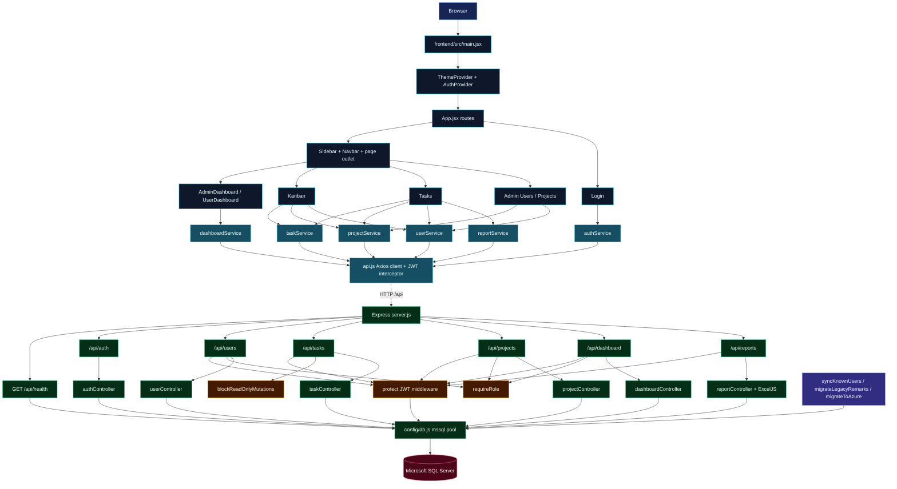
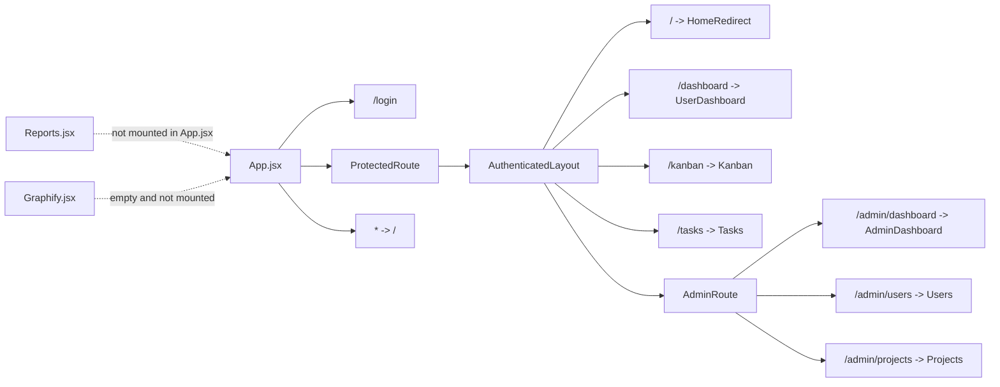
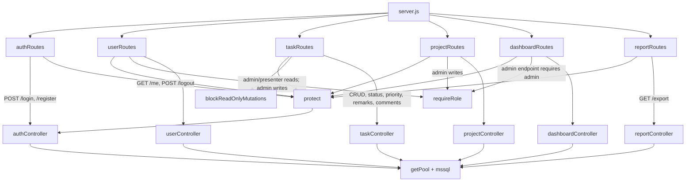
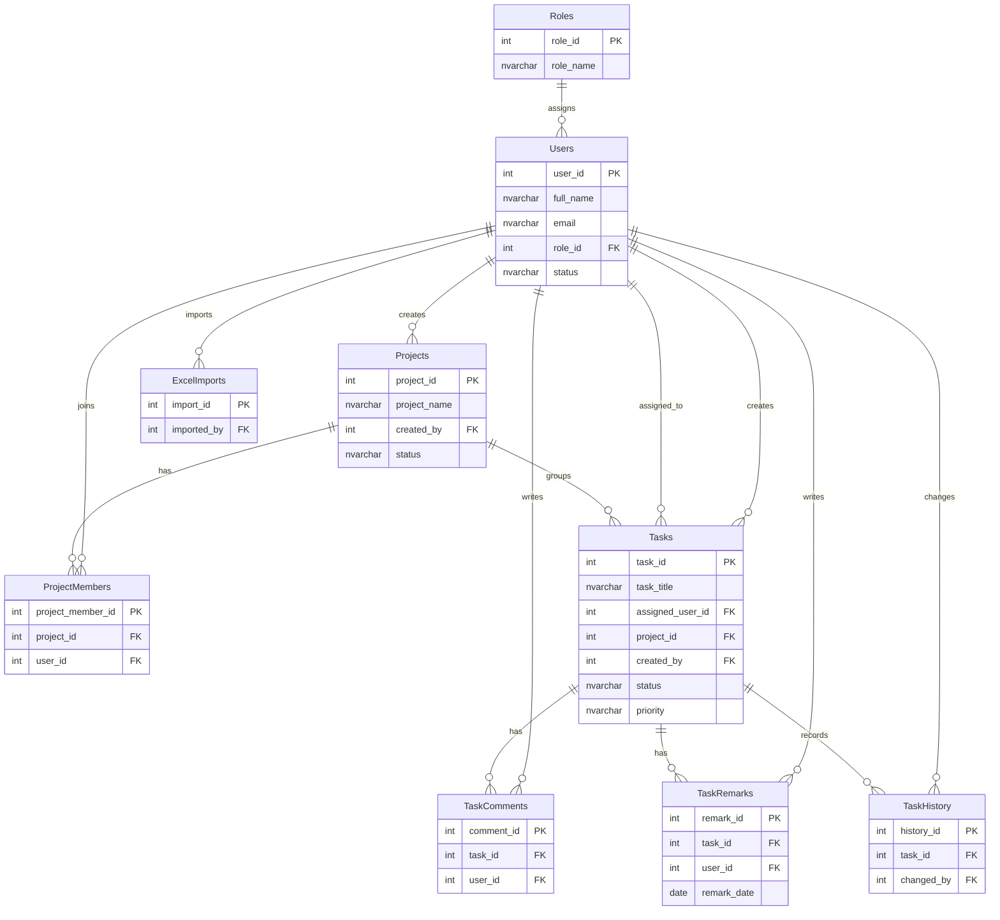

# Zira Agile Task Management - Architecture

Generated from the current repository layout. This map reflects the code under
`frontend/src`, `backend/src`, and `database`.

## System Graph

## Frontend Routes

## Frontend Composition

```mermaid
graph TD
    Main["main.jsx"] --> ThemeContext["ThemeContext"]
    Main --> AuthContext["AuthContext"]
    Main --> App["App.jsx"]
    AuthContext --> AuthService["authService"]
    App --> Sidebar["Sidebar"]
    App --> Navbar["Navbar"]
    App --> ProtectedRoute["ProtectedRoute"]
    App --> AdminRoute["AdminRoute"]

    DashboardWrappers["AdminDashboard / UserDashboard"] --> DashboardView["DashboardView"]
    DashboardView --> StatCard["StatCard"]
    DashboardView --> DashboardSkeleton["DashboardSkeletonLoader"]
    DashboardView --> Recharts["Recharts charts"]
    DashboardView --> DashboardService["dashboardService"]

    Kanban["Kanban"] --> KanbanBoard["KanbanBoard"]
    KanbanBoard --> KanbanColumn["KanbanColumn"]
    KanbanColumn --> TaskCard["TaskCard"]
    Kanban --> TaskModal["TaskModal"]
    Kanban --> TaskService["taskService"]
    Kanban --> ProjectService["projectService"]
    Kanban --> UserService["userService"]

    Tasks["Tasks"] --> FilterBar["FilterBar"]
    Tasks --> DataTable["DataTable"]
    Tasks --> TaskModal
    Tasks --> ConfirmModal["ConfirmModal"]
    Tasks --> ReportService["reportService"]
    TaskModal --> TaskForm["TaskForm"]
    TaskModal --> RemarksFilter["RemarksFilter"]
    RemarksFilter --> Calendar["ui/calendar"]

    Users["Users"] --> DataTable
    Users --> ConfirmModal
    Users --> UserService
    Projects["Projects"] --> DataTable
    Projects --> ConfirmModal
    Projects --> ProjectService

    AuthService --> Api["api.js"]
    DashboardService --> Api
    TaskService --> Api
    ProjectService --> Api
    UserService --> Api
    ReportService --> Api
```

## Backend Routes

## Database Entities

## Notes

- Authentication is JWT based. `api.js` attaches the saved token to requests, and
  backend `protect` reloads the active user from SQL Server.
- Presenter mode is represented in the auth context and JWT/session handling as a
  read-only mode; it blocks non-GET task mutations through `blockReadOnlyMutations`.
- `Reports.jsx` exists and can export Excel through `reportService`, but it is not
  currently mounted in `App.jsx`.
- `Graphify.jsx` exists as an empty page file and is not currently mounted.
- `database/schema.sql` defines `admin` and `user` role names; presenter behavior
  is handled in application/session logic rather than as a schema role.
